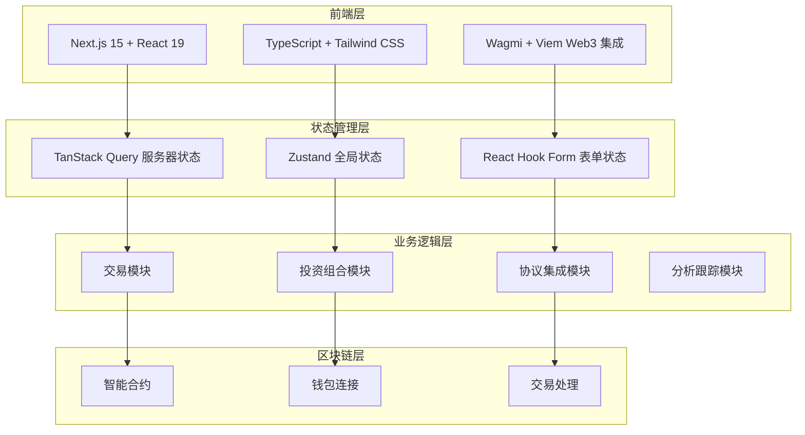
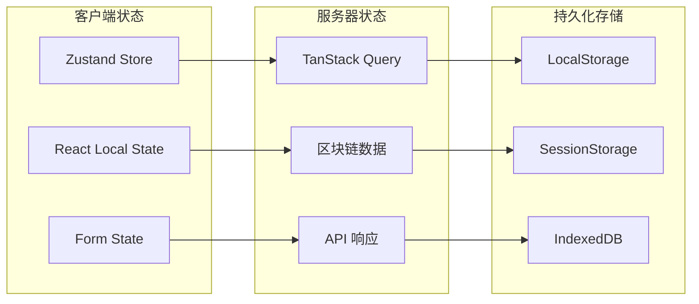

# Tadle 系统概览

## 项目介绍

**Tadle** 是一个创新的去中心化金融（DeFi）聚合平台，致力于为用户提供全面、安全、易用的区块链金融服务。通过"平行沙盒"架构，Tadle 整合了交易、投资管理、协议集成、代币发行等多种 DeFi 功能，构建了一个完整的 Web3 生态系统。

### 核心特色

- 🏗️ **平行沙盒架构**：创新的双账户系统（EOA + DSA）
- 🔧 **多协议集成**：集成 Uniswap、Ambient、Apriori、Magma 等主流协议
- 💱 **全栈交易**：从现货交易到预测市场的完整交易生态
- 🎨 **用户友好**：直观的界面设计和流畅的用户体验
- 🔐 **安全可靠**：多重安全验证和智能合约审计
- 📱 **响应式设计**：完美适配桌面和移动设备

## 系统架构总览

### 技术栈概览



### 应用层次结构

```
┌─────────────────────────────────────────┐
│                用户界面层                 │
├─────────────────────────────────────────┤
│  交易页面 │ 投资组合 │ 协议页面 │ 管理页面  │
├─────────────────────────────────────────┤
│                组件库                    │
├─────────────────────────────────────────┤
│   UI组件  │  业务组件 │  布局组件 │ 表单组件 │
├─────────────────────────────────────────┤
│              业务逻辑层                   │
├─────────────────────────────────────────┤
│ 状态管理  │  数据获取 │ 事件处理  │ 工具函数  │
├─────────────────────────────────────────┤
│               Web3集成层                 │
├─────────────────────────────────────────┤
│ 钱包连接  │  合约调用 │ 交易发送  │ 事件监听  │
├─────────────────────────────────────────┤
│              区块链基础层                 │
└─────────────────────────────────────────┘
│ Ethereum │ Polygon │ Monad │ Base │ 其他链 │
└─────────────────────────────────────────┘
```

## 核心功能模块

### 1. 交易与兑换系统

**技术实现**:
- **智能路由**: 基于 Uniswap V3 的最优价格发现
- **滑点保护**: 动态滑点计算和用户自定义设置
- **Gas 优化**: 智能 Gas 估算和批量交易优化
- **实时报价**: WebSocket 连接实现价格实时更新

**核心组件**:
```typescript
// 交易核心组件架构
TokenContent
├── TokenDropSelector     // 代币选择器
├── SlippageSettings     // 滑点设置
├── SwapButton          // 交易按钮
└── TransactionModal    // 交易确认弹窗
```

### 2. 投资组合管理

**双账户系统**:
- **资金账户 (Funding)**: 资产存储和管理
- **交易账户 (Trading)**: 活跃交易和投注

**技术特性**:
- **实时余额**: 多链余额聚合显示
- **收益追踪**: 历史收益和 PnL 计算
- **资产转移**: 账户间即时转账功能
- **风险管理**: 投资组合风险评估

### 3. 协议生态集成

#### Uniswap 集成
```typescript
// Uniswap 协议适配器
interface UniswapAdapter {
  swap(params: SwapParams): Promise<Transaction>;
  addLiquidity(params: LiquidityParams): Promise<Transaction>;
  createPosition(params: PositionParams): Promise<Transaction>;
}
```

#### Ambient 协议
- **集中流动性**: 资本效率优化
- **价格区间**: 自定义流动性范围
- **收益优化**: 动态费用调整

#### 质押协议 (Apriori & Magma)
- **质押奖励**: 自动复投机制
- **解质押**: 灵活的退出策略
- **收益分发**: 公平的奖励分配

### 4. NAD 生态系统

#### NAD Fun 代币平台
**功能特性**:
- **代币创建**: 一键式代币发行
- **交易市场**: 内置 AMM 交易机制
- **社区功能**: 代币持有者治理

**技术架构**:
```typescript
// NAD Fun 核心功能
class NADFunPlatform {
  createToken(metadata: TokenMetadata): Promise<TokenContract>;
  buyToken(tokenId: string, amount: BigNumber): Promise<Transaction>;
  sellToken(tokenId: string, amount: BigNumber): Promise<Transaction>;
}
```

#### NAD 域名服务
- **域名注册**: .nad 域名注册系统
- **地址解析**: 人性化地址映射
- **所有权管理**: 域名转移和续费

### 5. 预测市场系统

**市场机制**:
- **二元市场**: Yes/No 预测市场
- **多选市场**: 多结果预测选项
- **连续市场**: 实时概率更新

**技术实现**:
```typescript
// 预测市场核心接口
interface PredictionMarket {
  createMarket(params: MarketParams): Promise<Market>;
  placeBet(marketId: string, outcome: Outcome, amount: BigNumber): Promise<Position>;
  resolveMarket(marketId: string, result: Result): Promise<Settlement>;
}
```

## 数据流与状态管理

### 状态管理架构



### 数据同步策略

**实时同步**:
- **WebSocket**: 价格和市场数据实时更新
- **区块链事件**: 智能合约事件监听
- **轮询机制**: 关键数据定期刷新

**缓存策略**:
- **内存缓存**: React Query 自动缓存
- **本地缓存**: 用户设置和偏好存储
- **智能失效**: 基于数据新鲜度的缓存失效

## 安全与可靠性

### 安全架构

#### 前端安全
```typescript
// 安全验证示例
class SecurityValidator {
  validateAddress(address: string): boolean;
  sanitizeInput(input: string): string;
  encryptSensitiveData(data: any): string;
  verifyTransactionSignature(tx: Transaction): boolean;
}
```

#### 智能合约安全
- **多重签名**: 关键操作需要多方确认
- **时间锁**: 重要变更的时间延迟机制
- **访问控制**: 基于角色的权限管理
- **紧急停止**: 异常情况下的应急机制

### 监控与告警

**错误监控**:
```typescript
// Sentry 错误追踪配置
Sentry.init({
  dsn: process.env.NEXT_PUBLIC_SENTRY_DSN,
  integrations: [
    new BrowserTracing(),
    new Replay()
  ],
  tracesSampleRate: 1.0,
});
```

**性能监控**:
- **Core Web Vitals**: 页面性能指标
- **交易性能**: 区块链交互延迟
- **API 响应**: 后端服务性能
- **错误率**: 系统稳定性指标

## 用户体验设计

### 响应式设计

**设备适配**:
```css
/* 响应式断点设计 */
.container {
  @apply px-4 md:px-8 lg:px-12 xl:px-16;
  @apply text-sm md:text-base lg:text-lg;
}

/* 移动端优化 */
@media (max-width: 768px) {
  .trade-interface {
    flex-direction: column;
    gap: 1rem;
  }
}
```

### 交互设计

**加载状态**:
- **骨架屏**: 优雅的内容加载展示
- **进度条**: 交易进度可视化
- **微交互**: 按钮点击和状态转换动画

**错误处理**:
```typescript
// 用户友好的错误处理
class ErrorHandler {
  handleWeb3Error(error: Web3Error): UserMessage {
    switch(error.code) {
      case 'USER_REJECTED':
        return { type: 'info', message: '用户取消了交易' };
      case 'INSUFFICIENT_FUNDS':
        return { type: 'error', message: '余额不足，请检查账户余额' };
      default:
        return { type: 'error', message: '交易失败，请重试' };
    }
  }
}
```

## 性能优化策略

### 代码优化

**分割策略**:
```typescript
// 路由级代码分割
const TradePage = dynamic(() => import('./trade/page'), {
  loading: () => <TradingSkeleton />
});

// 组件级懒加载
const HeavyChart = lazy(() => import('./components/HeavyChart'));
```

### 网络优化

**资源优化**:
- **图片优化**: Next.js Image 组件自动优化
- **字体优化**: 字体文件预加载和优化
- **CSS 优化**: Tailwind 的 Purge 减小体积
- **JS 优化**: Tree shaking 移除未使用代码

### 缓存优化

**多级缓存**:
```typescript
// 缓存配置示例
const cacheConfig = {
  // 浏览器缓存
  browserCache: {
    staticAssets: '1y',
    dynamicContent: '1h'
  },
  // 内存缓存
  memoryCache: {
    queryResults: '5m',
    userPreferences: '1h'
  },
  // API 缓存
  apiCache: {
    tokenPrices: '30s',
    portfolioData: '2m'
  }
};
```

## 部署与运维

### 部署架构

**多环境部署**:
```yaml
# 部署配置示例
environments:
  development:
    url: https://dev.tadle.com
    features: all_enabled
  
  staging:
    url: https://staging.tadle.com  
    features: testing_features
    
  production:
    url: https://tadle.com
    features: stable_only
```

### 监控体系

**业务指标**:
- **DAU/MAU**: 日活跃/月活跃用户
- **交易量**: 日交易量和手续费收入
- **转化率**: 用户注册到首次交易的转化
- **留存率**: 用户留存和活跃度

**技术指标**:
- **可用性**: 系统正常运行时间
- **响应时间**: API 和页面响应速度
- **错误率**: 系统错误发生频率
- **吞吐量**: 系统处理能力

## 扩展规划

### 水平扩展

**多链支持**:
```typescript
// 多链架构设计
interface ChainAdapter {
  chainId: number;
  name: string;
  rpcUrl: string;
  nativeCurrency: Currency;
  blockExplorer: string;
  
  // 统一接口
  getBalance(address: string): Promise<BigNumber>;
  sendTransaction(tx: Transaction): Promise<TransactionResult>;
}
```

**协议扩展**:
- **标准化接口**: 新协议接入的标准化流程
- **插件系统**: 可插拔的协议适配器
- **配置化**: 通过配置文件管理协议参数

### 垂直扩展

**功能增强**:
- **高级交易**: 限价单、止损单等订单类型
- **策略交易**: 自动化交易策略
- **社交功能**: 用户社区和分享功能
- **移动应用**: 原生移动应用开发

**技术升级**:
- **性能优化**: 更先进的缓存和优化策略
- **安全增强**: 更多安全检查和防护措施
- **用户体验**: AI 驱动的个性化体验

## 总结

Tadle 系统通过现代化的技术栈、模块化的架构设计和完善的安全机制，构建了一个功能丰富、性能卓越的 DeFi 聚合平台。系统不仅满足当前的业务需求，更为未来的功能扩展和技术升级奠定了坚实基础。

通过持续的技术创新和用户体验优化，Tadle 致力于成为 Web3 生态系统中最值得信赖的 DeFi 平台，为用户提供安全、高效、便捷的去中心化金融服务。